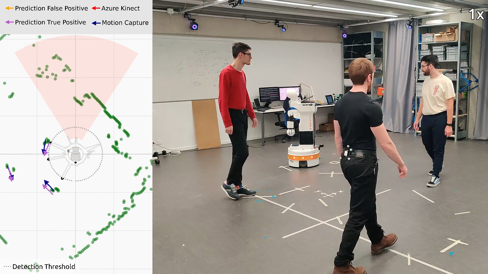

# Sixth-Sense: Self-Supervised Learning of Spatial Awareness of Humans from a Planar Lidar

*Simone Arreghini, Nicholas Carlotti, Mirko Nava, Antonio Paolillo, and Alessandro Giusti*

Dalle Molle Institute for Artificial Intelligence, USI-SUPSI, Lugano (Switzerland)

## Informations

### Paper Abstract

Reliable localization of people is fundamental for service robots that must operate in close social interaction with humans. State-of-the-art human detectors often rely on RGB-D cameras or costly 3D LiDARs. However, most commercial
robots are equipped with cameras with a narrow field of view, leaving them unaware of users approaching from other directions, or inexpensive 1D LiDARs whose readings are hard to interpret. To address these limitations, we propose a self-supervised approach to detect humans and estimate their 2D pose from 1D LiDAR data, using detections from an RGB-D
camera as supervision. Trained on 70 minutes of autonomously collected data, our model detects humans omnidirectionally in unseen environments with 71% precision, 80% recall, and mean absolute errors of 13 cm in distance and 44◦ in orientation, measured against ground truth data. Beyond raw detection accuracy, this capability is relevant for service robots operating in shared public spaces, where omnidirectional awareness of nearby people can support safer navigation, more appropriate approach behavior, and timely interaction initiation using low-cost, privacy-preserving sensing. Deployment in two additional public environments further suggests that the approach can serve as a practical wide-FOV awareness layer for socially aware service-robot behavior in unseen conditions.

The paper has been accepted at ARSO 2026. The pdf is available on arXiv [TODO]().

### ARSO Video Submission (Click to start the video)

[](https://youtu.be/0aikTz2cN_c)

Cite this work:
```
@inproceedings{todo,
 author = {todo},
 title = {todo},
 booktitle={todo}, 
 pages = {-},
 year = {todo},
}
```

## Installation Instructions

To install this package, as well as any dependency:
```bash
pip install -e .
```
This will automatically install any dependency in your Python environment. Please use a version of Python>=3.10

### Usage

Download and extract our dataset from Zenodo at this [URL](https://zenodo.org/records/14936069).

Copy or make a symlink to the extracted content to the folder /hdf5 such that it directly contains the *break_area*, *corridor*, and *lab* folders.

#### Train a new model
The file "lidar_human_pose_estimation/config/train_config.yaml" can be used to change the model architecture as well as the loss function used.

A new model can be trained using the command:
```
python -m lidar_human_pose_estimation.core.train -i <PATH_TO_THE_TRAIN_CONFIG_FILE>
```

The model will be saved in the model folder of this repository.

#### Test a model performance
The performance of a model on a specific dataset can be tested with:
```
python -m lidar_human_pose_estimation.core.test -m <PATH_TO_THE_MODEL_FOLDER> -v <PATH_TO_THE_TEST_DATASET> --device cpu
```

This function will output some model performance metrics as well as create plots. 

#### Visualization
Depending on what you need to visualize three different Python scripts can be used.

To visualize only the content of an h5 file:
```
python -m lidar_human_pose_estimation.visualization.vis_h5 -i <PATH_TO_THE_DATASET> -o <PATH_TO_THE_VIDEO_OUTPUT_FOLDER>
```

To visualize also the optitrack data in a dataset (only for "Lab" environment): 
```
python -m lidar_human_pose_estimation.visualization.vis_h5_optitrack -i <PATH_TO_THE_DATASET> -o <PATH_TO_THE_VIDEO_OUTPUT_FOLDER>
```

To visualize how a model performs : 
```
python -m lidar_human_pose_estimation.visualization.vis_model -i  <PATH_TO_THE_DATASET> -m <PATH_TO_THE_MODEL_FOLDER> --device cpu -o <PATH_TO_THE_VIDEO_OUTPUT_FOLDER>
```


